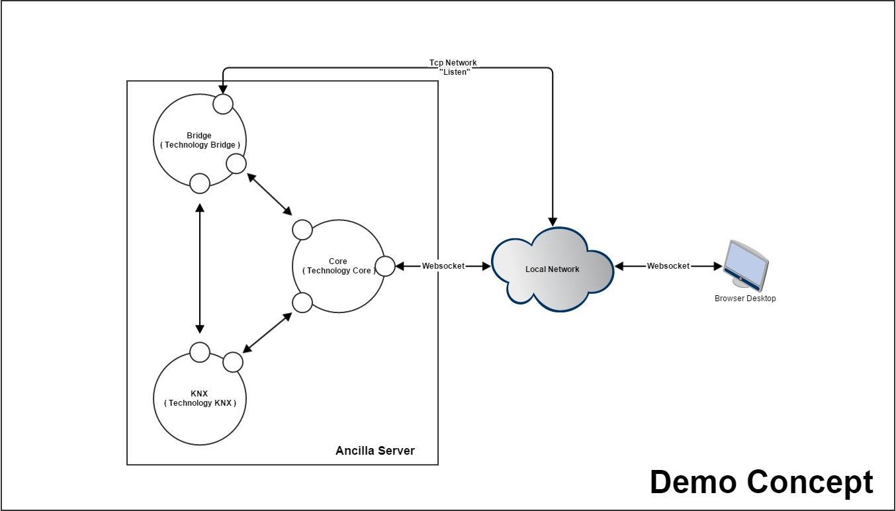
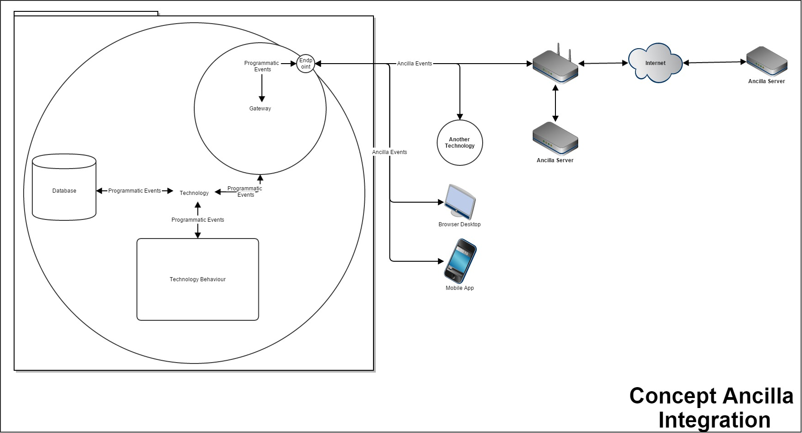

Ancilla Server — Free Home Automation
==================================================

[](https://travis-ci.org/KingRial/Ancilla-Server) [](https://gitter.im/KingRial/Ancilla-Server?utm_source=badge&utm_medium=badge&utm_campaign=pr-badge&utm_content=badge)

This is the server-side part of the Ancilla project.
Built with [nodeJS](https://nodejs.org/) the purpose is to create a scalable, secure, customizable and free solution to handle home automation.

See documentation for details.

*Please be aware this is just an experimental version used to test technologies and solutions; it's still far from being the final result*
The current main branch is still under rework.
If you wish to find a functional experimental release, please check the "GiT releases".

*Any idea or contribution is welcome!*

Changelog
----------------------------


Project documentation
----------------------------
Here a simple and minimal description of the experimental project intent.

Using Ancilla as a middleware will allow to easily create independent sandboxes for each technology desired to be integrated inside the home automation.

The Ancilla server is composed by:
- a "Core" service able to centralize all the aspects for a correct supervision
- multiple independent "Technology" services for each handled technology
On the previous concept there "Core" service will handle all the communications with the clients and will start the two other services.
- The KNX service will handle the communication with the KNX bus and signal specific events to the "Core" when needed
- The Bridge service is a simple technology which will just route every information received on a specific endpoints to all the other endpoints.

Each service can be described with the following concept diagram:

The technology, like a simple plugin or addon, is independent from all the rest of the Ancilla software using it's own database if needed and it's own programming logics.
However it will communicate with all the other services by a standard message called "Ancilla Event".

Each "Ancilla Event" is just a simple JSON message following specific signatures.

API
----------------------------
Here the [API documentation](http://kingrial.github.io/Ancilla-Server/doc/Ancilla.node.html) for Ancilla

How to install your own Ancilla server
----------------------------

Clone a copy of the main Ancilla server git repo by running:

```bash
git clone https://github.com/KingRial/Ancilla-Server.git
```

Enter the ancilla directory and run the build script:
```bash
npm install
```

Now you are ready to start the server execution and all the technologies configured into the server's database
```bash
node Ancilla.js
```
if node still doesn't support ES6 standards:
```bash
babel-node Ancilla.js
```
if you don't have the module "babel" installed as global use the folloging path
```bash
node_modules/.bin/babel-node Ancilla.js
```

If you wish to see all the debug messages use the following options while starting the server
```bash
babel-node Ancilla.js --debug
```

If you wish to run a specific technology or integration
```bash
babel-node integrations/Technology.Demo.js
```

Running the Tests
--------------------------------------
Using "[vows](http://vowsjs.org/)".
First you must install vows:
```bash
npm install vows
```
then you cal call the following command:
```bash
npm test
```

The future
--------------------------------------
- Evaluate if Breeze could be used to allow datas collection from Web UI
- Add behaviour driven tests
- Add Nest support
- Add KNX support
- Add HTTPS/WSS support
- Improve security
- more to come!

License
-------
[GNU3](http://www.gnu.org/licenses/gpl-3.0.html)
